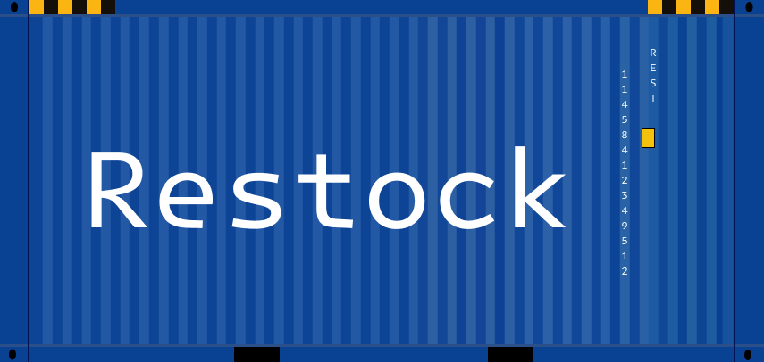

# Restock
Restock is a game made in Godot where you have to build factories, connect them and complete deliveries to make profit for your company.

## Demo
Play it in your browser on Itch.io: https://nils1024.itch.io/restock

## How to Contribute?
Contributions are always welcome

1. Download Godot
2. Clone the repository
3. Make your changes
4. Open a pull request on GitHub

## Deploy
1. Open the project in Godot >= 4.6
2. Click Project -> Export
3. Click "Add..."
4. Click Web
5. Click "Manage Export Templates" (skip if you already have them installed)
	1. Click "Download and Install"
	2. Click "Close" once the download has finished
6. Reopen Project -> Export
5. Click "Export Project..."

## Music credits
Song 1 by <a href="https://pixabay.com/users/delosound-46524562/?utm_source=link-attribution&utm_medium=referral&utm_campaign=music&utm_content=298550">DELOSound</a> from <a href="https://pixabay.com/music//?utm_source=link-attribution&utm_medium=referral&utm_campaign=music&utm_content=298550">Pixabay</a>

## AI Declaration
I used AI to generate typical boilerplate code and for inspiration (because
sometimes there are special Godot functions that I dont know about or when
I have written something myself, the AI had a nice idea to make the code more
readable or robust), so I could focus more on the game's architecture. In
addition, I didnt just copy-pasted the code, instead I typed it off while also reading
the documentation (if it was a Godot function) to get a better understanding of it.
